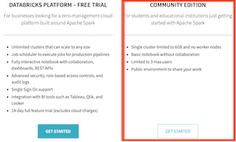

# Big Data Computing (2021-2022)

[News](#News) | [General Information](#General-Information) | [Syllabus](#Syllabus) | [Environment Setup](#Environment-Setup) | [Class Schedules](#Class-Schedules) | [Previous Years](#Previous-Years)

## News
- **February 2022 Exam Session: Final Grades** 
Final grades are available at this [link](./exams/2021-22/2022-02-08_final_grades.pdf).
- **February 2022 Exam Session: Project Presentation Schedule** 
Presentations of the projects that have been accepted for oral discussion will take place remotely via Google Meet on **February 8, 2021, at 10:00 a.m. CET**, using the link indicated in the message sent on the Moodle forum. _Everyone is welcome to join!_
- **February 2022 Exam Session** 
Registrations to the February 2022 exam session are open on Infostud (id **793404**), and so they will until **February 4, 2022**.
Project submission week opens up on **January 29, 2022 at 00:00 a.m. CET** ([Central European Time](https://time.is/CET)) and closes on **February 4, 2022 at 11:59 p.m. CET**. 
(_Please, see the announcement below for additional details on how to submit your project during this session, which is the first one of the academic year 2021-22._)
- Students who are planning to submit their projects **after** the January 2022 session should refer to the <a href="https://elearning.uniroma1.it/course/view.php?id=14454" target="_blank">Big Data Computing 2021-22 Moodle page</a>, rather than the current one (i.e., Big Data Computing 2020-21). This is to align exam sessions to the correct academic year, since academic year 2020-21 formally ends on January, 31 2022. As such, starting **from February 2022 until January 2023** all the exam sessions will be displayed on the newly created Moodle page indicated above, where students will be allowed to submit their work on the corresponding Project Submission Week that will be opened along the way, as usual. For example, the upcoming February Submission Week is available at the following <a href="https://elearning.uniroma1.it/mod/assign/view.php?id=447219" target="_blank">link</a>. (**NOTE:** _Only students who expect to complete the exam in one of the upcoming 2021-22 sessions must subscribe to the Big Data Computing 2021-22 Moodle page!_)

## General Information

Welcome to the Big Data Computing class!

This is a first-year, second-semester course of the [MSc in Computer Science of Sapienza University of Rome](https://www.studiareinformatica.uniroma1.it/master-course-computer-science).

This repository contains class material along with any useful information for the 2021-2022 academic year.

### Class Schedule
- **Tuesday** from **5:00 p.m.** to **7:00 p.m.**
- **Wednesday** from **8:00 a.m.** to **11:00 a.m.**

### How to Attend Classes
According to the guidelines provided by Sapienza University to contrast the COVID-19 pandemic, the course will be held **both** in-person and remotely. For any further information, students must refer to the official documentation available on the [Sapienza website](https://www.uniroma1.it/en/notizia/covid-19-phase-3-person-and-online-classes-exams-and-graduation-sessions).

#### Attending Classes in Person: Room 1L - Via del Castro Laurenziano 7a
Students who are willing to attend classes in-person must issue their request through the [Infostud Lab App](https://www.uniroma1.it/en/notizia/new-apps-sapienza-students) or the [Prodigit Sapienza](https://prodigit.uniroma1.it/) online booking system, according to the rules established (please, see [here](https://www.uniroma1.it/en/notizia/covid-19-phase-3-person-and-online-classes-exams-and-graduation-sessions)). Once the booking is confirmed - according to the class schedule above - students must go to Room 1L, which is located in Via del Castro Laurenziano 7a.

#### Attending Classes Remotely: Zoom
Students who are willing to attend classes remotely online **must** register to the dedicated Zoom conference, using the following link: https://uniroma1.zoom.us/meeting/register/tZAkdOysqjkiG9SU5I1rG-oENGV-RIfCxLwv

### Moodle Web Page
Students must subscribe to the Moodle web page using the same credentials (username/password) to access Wi-Fi network and Infostud services, at the following link: https://elearning.uniroma1.it/course/view.php?id=14454

### Contacts
- Email: tolomei@di.uniroma1.it
- Website: https://www.di.uniroma1.it/~tolomei
- Bacheca Sapienza: https://corsidilaurea.uniroma1.it/it/users/gabrieletolomeiuniroma1it

### Office Hours
Please, drop me a message at <a href="mailto:tolomei@di.uniroma1.it">tolomei@di.uniroma1.it</a> in case you would like to schedule a meeting, either online (i.e., via Google Meet or Zoom) or in-person (i.e., in Room 106 located at the 1st floor of Building E in Viale Regina Elena 295).

### Description and Goals
The amount, variety, and rate at which data is being generated nowadays both by humans and machines are unprecedented. This opens up a number of challenges on how to deal with those data, as traditional computing paradigms are not conceived to operate at such a scale.

"Big Data" is the umbrella term that has rapidly become popular to describe methodologies and tools specifically designed for collecting, storing, and processing very large or complex data sets. In addition to addressing foundational computer science problems, such as searching and sorting, big data computing mainly focuses on extracting knowledge - thereby value - from large-scale data sets using advanced data analysis techniques, such as machine learning.

This course is intended to provide graduate-level students with a deep understanding of programming models and tools that are suitable for the large-scale analysis of data distributed across clusters of computers. More specifically, the course will give students the ability to proficiently develop big data/machine learning solutions on top of industry-standard frameworks, such as Hadoop and Spark, to tackle real-world problems faced by the so-called "Big Five" tech companies (i.e., Apple, Amazon, Google, Microsoft, and Facebook): text/graph analysis, classification/regression, and recommendation, just to name a few.

### Prerequisites
The course assumes that students are familiar with the basics of data analysis and machine learning, properly supported by a strong knowledge of foundational concepts of calculus, linear algebra, and probability and statistics. In addition, students must have non-trivial computer programming skills (preferably using Python programming language). Previous experience with Hadoop, Spark, or distributed computing is not required.

### Exams
Students must prove their level of comprehension of the subject by developing a **software project**, leveraging the set of methodologies and tools introduced during classes. Projects must of course refer to typical Big Data tasks: e.g., clustering, prediction, recommendation (just to name a few) using very-large datasets in _any_ application domain of interest. 
Anyway, the topic of the project **must be first agreed with the teacher** through a proposal that must be sent **at least one month before** the targeted project submission deadline. **NOTE:** _Only the projects that have been successfully approved will be considered for grading!_ 
References where to select interesting projects will be suggested throughout the course (e.g., [Kaggle](https://www.kaggle.com/)). However, I strongly encourage you to come up with your own original ideas, as creativity will be very much appreciated. 
Projects can be done either **individually** or in group of **at most 2 students**, and they should be accompanied by a brief presentation written in english (e.g., a few PowerPoint slides). Finally, there will be an oral exam where submitted projects will be discussed in english; other questions on _any_ topic addressed during the course may also be asked, but those can be answered either in english or in italian, as the student prefers. 
A document containing the main guidelines for the final project will be made available soon. Please, stay tuned! <!--[here](./extra/Final_Project_Guidelines.pdf).-->

### Recommended Textbooks
No textbooks are mandatory to successfully follow this course. However, there is a huge set of references which may be worth mentioning, especially to those who wants to dig deeper into some specific topics. Among those, some readings I would like to suggest are as follows:
- _Mining of Massive Datasets_ [Leskovec, Rajaraman, Ullman] [available online](http://infolab.stanford.edu/~ullman/mmds/book.pdf).
- _Big Data Analysis with Python_ [Marin, Shukla, VK]
- _Large Scale Machine Learning with Python_ [Sjardin, Massaron, Boschetti]
- _Spark: The Definitive Guide_ [Chambers, Zaharia]
- _Learning Spark: Lightning-Fast Big Data Analysis_ [Karau, Konwinski, Wendell, Zaharia]
- _Hadoop: The Definitive Guide_ [White]
- _Python for Data Analysis_ [Mckinney]
 

## Syllabus: TBA

**Introduction**
- The Big Data Phenomenon
- The Big Data Infrastructure
    - Distributed File Systems (HDFS)
    - MapReduce (Hadoop)
    - Spark
- PySpark + Databricks

**Unsupervised Learning: Clustering**
- Similarity Measures
- Algorithms: K-means
- Example: Document Clustering

**Dimensionality Reduction**
- Feature Extraction
- Algorithms: Principal Component Analysis (PCA)
- Example: PCA + Handwritten Digit Recognition

**Supervised Learning**
- Basics of Machine Learning
- Regression/Classification
- Algorithms: Linear Regression/Logistic Regression/Random Forest
- Examples: 
    - Linear Regression -> House Pricing Prediction (i.e., predict the price which a house will be sold)
    - Logistic Regression/Random Forest -> Marketing Campaign Prediction (i.e., predict whether a customer will subscribe a term deposit of a bank)

**Recommender Systems**
- Content-based vs. Collaborative filtering
- Algorithms: k-NN, Matrix Factorization (MF)
- Example: Movie Recommender System (MovieLens)

**Graph Analysis**
- Link Analysis
- Algorithms: PageRank
- Example: Ranking (a sample of) the Google Web Graph

## Environment Setup: TBA

<!--### PySpark + Databricks
In this course, we will be using the Python application programming interface to the Apache Spark framework (a.k.a. [PySpark](https://spark.apache.org/docs/latest/api/python/index.html)), in combination with [Databricks](https://databricks.com/). This will allows you to write and execute PySpark (as well as pure Python, for that matters) in your browser, with:
- Zero configuration required;
- Free access to Databricks' powerful cloud infrastructure (including GPUs);
- Easy sharing.

#### Why Databricks?
Starting from this year, our Big Data Computing class at Sapienza has joined the [Databricks University Alliance](https://databricks.com/university). This is a very active community of educators and faculty members who collaboratively share ideas, thoughts, and actual material on how to improve their teaching experience of Data-Science-like classes, which ultimately allow students to learn the latest data science tools used in the industry.

#### Where Should I Start with Databricks?
The first thing you have to do in order to start using Databricks is to set up a personal account.
Databricks accounts come in two flavours: 
- **Full Platform** (_payment_, _14-day trial_)
- **Community Edition** (_free_)

The former is the standard payment account, which gives you access to the fully-fledged Databricks' data analytics platform based either on Microsoft Azure or Amazon AWS computational resources.
The latter, instead, allows you to enjoy Databricks on Amazon AWS for free (of course with some limitations!)

For the aim of our class, students **must all** sign up for a personal **Databricks Community Edition** account using this [link](https://community.cloud.databricks.com/login.html). 
Please, be sure to select the correct type of account, as highlighted in the snapshot below:

For any further information, please follow the instructions provided in the [documentation](https://docs.databricks.com/getting-started/try-databricks.html#community-edition-1).

#### What Databricks Resources Should I Use?
Many big companies have started relying on Databricks platform for running their data analytics tasks. As such, Databricks is really well-documented and provides you with a lot of useful material to consult. Among such material, I would suggest you to check out the following:
- A self-paced training course, whose instructions on how to access it are available [here](./databricks/databricks_self_paced_training.pdf)
- A [four-part tutorial](https://databricks.com/discover/introduction-to-data-analysis-workshop-series) on data analyitics with Databricks
- The official [Databricks documentation](https://docs.databricks.com/)

##

Optionally, you may also want to install PySpark on your own local machine.

(**NOTE:** This step is **not** required for passing this class)

### Local Mode Setup [Optional]
In case you would like to install and configure PySpark _also_ on your local machine, please follow the instructions described [here](./oldest/2019-20.md#Local-Mode-Setup). Note that those guidelines may refer to older (or, even worst, deprecated) versions of the required installation packages; please, see the official [PySpark documentation](https://pypi.org/project/pyspark/) for the the most updated installation instructions.
-->

## Class Schedules

| Lecture \#  | Date       | Topic                                         | Material        | 
|-------------|------------|-----------------------------------------------|-----------------|
| Lecture 1   | 02/22/2022 | Introduction to Big Data: Motivations and Challenges | [slides: <a href="./slides/01_Intro.pdf" target="_blank">PDF</a>] |
| Lecture 2   | 02/23/2022 | MapReduce Programming Model | [slides: <a href="./slides/02_MapReduce.pdf" target="_blank">PDF</a>] |
<!--| Lecture 3   | 03/03/2021 | Apache Spark | [slides: <a href="./slides/03_Spark.pdf" target="_blank">PDF</a>] |
| Lecture 4   | 03/09/2021 | PySpark Tutorial (with Databricks) | [notebook: <a href="./notebooks/PySpark_Tutorial.ipynb" target="_blank">ipynb</a>] |
| Lecture 5-6  | 03/10/2021 - 03/16/2021 | Clustering | [slides: <a href="./slides/04_Clustering.pdf" target="_blank">PDF</a>] |
| Lecture 7-8 | 03/17/2021 - 03/23/2021 | Clustering Algorithms: K-means | [slides: <a href="./slides/05_Clustering_Algorithms.pdf" target="_blank">PDF</a>] |
| Lecture 9   | 03/24/2021 | Document Clustering with PySpark | [slides: <a href="./slides/06_Document_Clustering.pdf" target="_blank">PDF</a>, notebook: <a href="./notebooks/Document_Clustering.ipynb" target="_blank">ipynb</a>] |
| Lecture 10-11   | 03/30/2021 - 03/31/2021 | Dimensionality Reduction (Principal Component Analysis) | [slides: <a href="./slides/07_Dimensionality_Reduction_(Principal_Component_Analysis).pdf" target="_blank">PDF</a>, notes: <a href="./extra/Notes_on_Principal_Component_Analysis.pdf" target="_blank">PDF</a>] |
| Lecture 12   | 04/07/2021 | Principal Component Analysis with PySpark | [notebook: <a href="./notebooks/Principal_Component_Analysis.ipynb" target="_blank">ipynb</a>] |
| Lecture 13  | 04/13/2021 | Supervised Learning | [slides: <a href="./slides/08_Supervised_Learning.pdf" target="_blank">PDF</a>] |
| Lecture 14-15  | 04/14/2021 - 04/20/2021 | Linear Regression | [slides: <a href="./slides/09_Linear_Regression.pdf" target="_blank">PDF</a>] |
| Lecture 16  | 04/21/2021 | Linear Regression with PySpark | [notebook: <a href="./notebooks/Linear_Regression.ipynb" target="_blank">ipynb</a>] |
| Lecture 17-18  | 04/27/2021-04/28/2021 | Logistic Regression | [slides: <a href="./slides/10_Logistic_Regression.pdf" target="_blank">PDF</a>, notes: <a href="./extra/Notes_on_Logistic_Regression.pdf" target="_blank">PDF</a>] |
| Lecture 19  | 05/04/2021 | Decision Trees and Ensembles | [slides: <a href="./slides/11_Decision_Trees_and_Ensembles.pdf" target="_blank">PDF</a>]|
| Lecture 20  | 05/05/2021 | Evaluation Metrics for Classification | [slides: <a href="./slides/12_Evaluation_Metrics_for_Classification.pdf" target="_blank">PDF</a>, notebook: <a href="./notebooks/Classification.ipynb" target="_blank">ipynb</a>]|
| Lecture 21  | 05/11/2021 | Recommender Systems (Part I) | [slides: <a href="./slides/13_Recommender_Systems_(Part_I).pdf" target="_blank">PDF</a>]|
| Lecture 22  | 05/12/2021 | Recommender Systems (Part II) | [slides: <a href="./slides/13_Recommender_Systems_(Part_II).pdf" target="_blank">PDF</a>, notebook: <a href="./notebooks/MF_Recommender_Systems.ipynb" target="_blank">ipynb</a>]|
| Lecture 23  | 05/18/2021 | Graph Link Analysis | [slides: <a href="./slides/14_Graph_Link_Analysis.pdf" target="_blank">PDF</a>]|
| Lecture 24  | 05/19/2021 | PageRank | [slides: <a href="./slides/15_PageRank.pdf" target="_blank">PDF</a>, notes: <a href="./extra/Notes_on_PageRank.pdf" target="_blank">PDF</a>, notebook: <a href="./notebooks/PageRank.ipynb" target="_blank">ipynb</a>]|
| ----------  | 05/19/2021 | The Last Take Home Message | [slides: <a href="./slides/16_The_Last_Take_Home_Message.pdf" target="_blank">PDF</a>]|
-->

# Previous Years
In the following, you can quickly navigate through Big Data Computing class information and material from previous years.

**NOTE:** _The folder containing the class material is **unique** and it is subject to changes and/or updates; as such, there may be differences between the content displayed on this website and what have been shown in class in the past._

-   [2019-20](./oldest/2019-20.md)
-   [2020-21](./oldest/2020-21.md)
